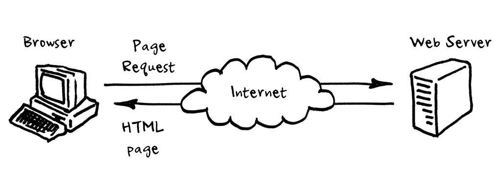
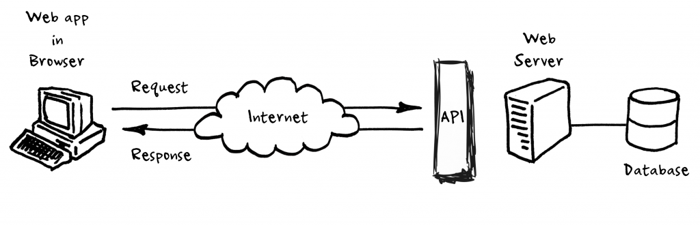
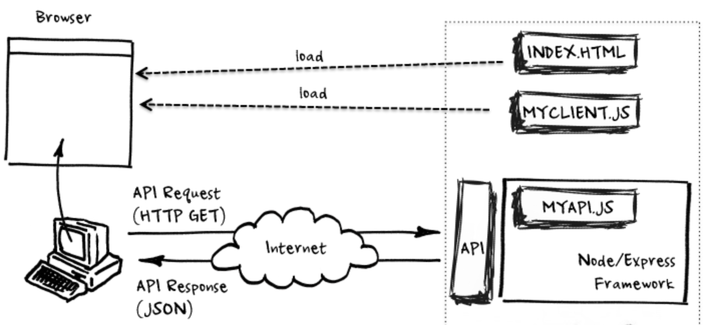
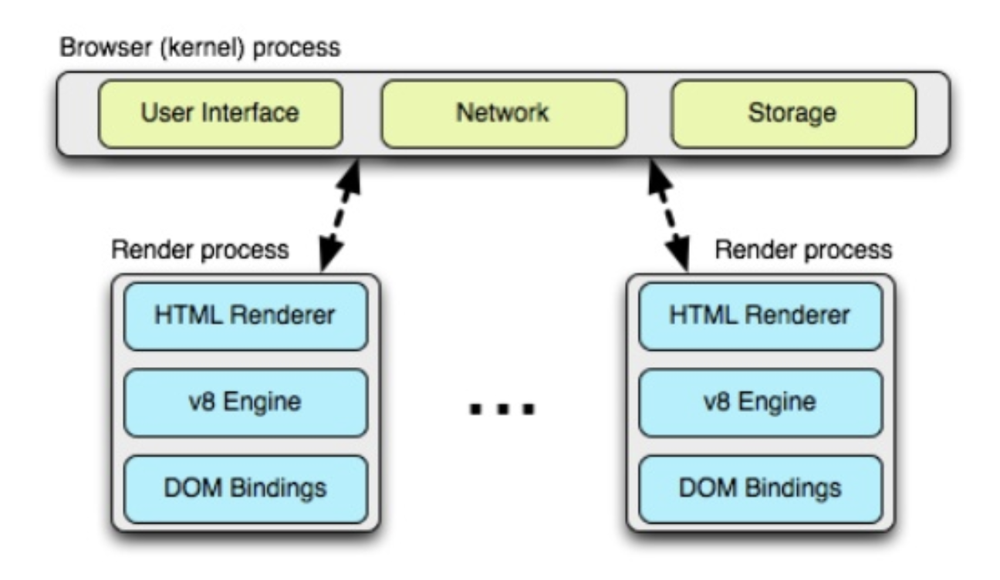
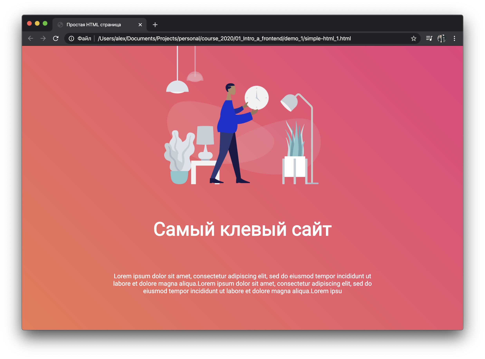
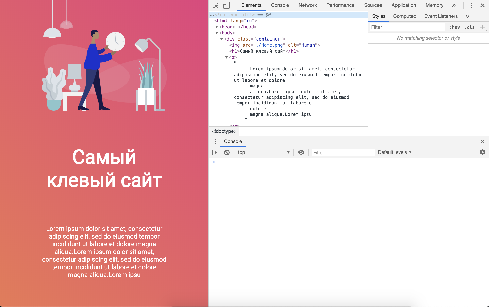

# Вводная часть

## Основные определения

`Frontend` - публичная часть веб приложений, с которой непосредственно взаимодействует пользователь. В сферу fronend входит отображение интерфейса, логика выполняющаяся на клиентской стороне, а также отправка сетевых запросов.

`Frontend vs Верстка` - Верстка - это тот код, что определяет местоположение объектов, шрифты, все что касается определения внешнего вида. Frontend - это про интерактивность, которая программируется на языке JavaScript.

`Web-приложение` - клиент-серверное приложение, в котором браузер является клиентом. Логика распределена между клиентом и сервером. Информация хранится преимущественно на сервере.

`Frontend разработка` - работа по созданию публичной части веб-приложений.

`Клиент-серверное взаимодействие` - Взаимодействие в котором вся работа распределена между поставщиками услуг, называемыми серверами, и пользователями услуг - клиентами.

## Клиент серверная модель

### Клиент

Клиент может быть устройством или программой. Когда говорится про устройство - подразумевается устройство с которого пользователь осуществляет выход в интернет, например: Ноутбук, ПК, смартфон, планшет.
В случае программы — программа которая позволяет пользователю делать запросы в интернет. Например браузер, месседжер и т.п.

Подводя вывод можно сказать, что клиент – устройство или программа, которая может осуществлять запросы в интернет.

### Сервер

Сервер же – всегда программа, не устройство, а ПО, обеспечивающее функциональность и обслуживающее другие программы – клиенты.

Сервер может обслуживать несколько клиентов одновременно 24/7 без остановки.

Так же можно запускать несколько серверов на одном устройстве.

#### Типы серверов

Существует несколько типов серверов, например:

- Веб-сервера (Apache, Nginx) - обслуживают HTTP запросы
- Сервера баз данных (MySQL)

Сервера могут содержать веб ресурсы, размещать веб-приложения, хранить пользовательские данные, и другие клевые штуки. Так же сервера постоянно ждут запросов и отвечают на них сообщениями.

### Так что же такое клиент серверная модель?

Клиент серверная модель – архитектура веба разделяющая устройства на 2 типа: Устройства которые выполняют запросы, называемые клиентами и устройства обрабатывающие запросы клиентов, называемыми серверами. Вся эта модель работает через цикл Запросов/Ответов, называемыми HTTP сообщениями.

Данная модель является путем одним из способов коммуникации в вебе.

## Развитие интернета

За всю историю с 1990г, структура веб-приложений претерпела некоторые изменения.

<p align="center">
  
</p>

1. `Веб-ресурсы.` Интернет состоял из набора страничек, которые просматривал пользователи. Все взаимодействие было с помощью гиперссылок.

<p align="center">
  
</p>

2. `Веб-сервисы.` Появились HTML-формы. Теперь пользователи не только потребляют контент, но и могут создавать его. На стороне сервера появился API и БД для хранения данных.

<p align="center">
  
</p>

3. `Веб-приложения.` С развитием мобильных устройств, увеличилось количество клиентов. Работать по старой схеме стало не выгодно. Поэтому был принят подход вынести часть логики с сервера на клиент. Появилась маршрутизация и генерация интерфейса на клиенте.

## Что находится внутри браузера?

<p align="center">
  
</p>

Современный браузер состоит из нескольких процессов. Первый - процесс браузера, в котором содержится работа с пользовательским интерфейсом, сетью, работа с диском и т.п.
А также создается по процессу на каждую открытую вкладку.

Присутствует процесс для рендера контента. Содержит внутри себя:

- Алгоритмы отрисовки HTML. (WebKit, Blink, Gecko, Presto)
- JS движок, исполняющий JS код в браузере. (V8, SpiderMonkey, JavaScriptCore)
- DOM Binding, способы для взаимодействия JS с HTML страницей.

Т.к в браузере выполняются приложения, написанные другими разработчиками, имеются несколько ограничений:

- Нельзя взаимодействовать с файловой системой.
- Нет доступа к сетевым функциям, кроме тех что предоставляет браузер.
- Нет способов организовывать многопоточные вычисления.
- Нельзя создавать новые процессы (Открывать другие программы).

## На чем создаются клиентская часть веб-приложений?

Приложения в браузере работают на трех основных технологиях:

- HTML - Про расположение объектов.
- CSS - Про внешний вид объектов.
- JavaScript - Про интерактивность объектов.

## Из чего состоит код веб-страницы?

### HTML

HTML (Hyper Text Markup Language) – Язык разметки документов во всемирной паутине. Отвечает за создание и расположение элементов страницы.

Страницы состоят из набора тегов, которые можно узнать по угловым скобкам. По ним браузер понимает, где простой текст, а где интерактивный элемент, например - видео.

История развития HTML:

- 1993 - HTML 2.0
- 1997 январь - HTML 3.2
- 1997 декабрь - HTML 4.0
- 1999 - HTML 4.1
- 2012 - HTML5

### CSS

CSS (Cascading Style Sheets) — формальный язык описания внешнего вида документа, написанного с использованием языка разметки.

### Обзор HTML страницы

Для того чтобы понять из чего состоит базовая HTML страничка откроем в Google Chrome [демо-страницу](./demo_1/simple-html_1.html) и посмотрим на нее.

<p align="center">
  
</p>

Нажмем на страницу правой кнопкой мыши и нажмем "Просмотреть код" и в окне браузера откроется панель разработчика. На ней мы можем увидеть структуру нашего документа, наводя на которые, можно увидеть что браузер выделяет их в окне страницы, позволяя просто определить какой элемент где находится на странице.

<p align="center">
  
</p>

Что есть в HTML коде? В нем есть определенные элементы, которые выглядят как английские слова окруженные угловыми стрелками, например: `<h1>`, `<p>` и т.д.
Эти элементы называются HTML тегами.

Полный список тегов, присутствующих в HTML, можно посмотреть [здесь](http://htmlbook.ru/html), либо самостоятельно найти в интернете. Большинство из них, практически никогда не используются.

Рассмотрим тег "`p`":

```html
<p>Какой либо текст</p>
```

первая его часть - `<p>`, является открывающей частью, вторая `</p>` - закрывающей. Отличается тем что у закрывающей после угловой скобки идет символ «слеш».

Внутри тегов располагаются некоторые слова называющиеся атрибутами тегов. Они имеют название и значение.
Например:

```html
<html lang="ru">
```

`lang` - в данном случае является атрибутом со значением `ru`.

Имя атрибута говорит браузеру, какой признак нужно поменять, а значение — каким этот признак должен стать.
Атрибуты встраиваются только в открывающий тег. Их значения пишут в одинарных или двойных кавычках. Порядок атрибутов не имеет значение.

Также в языке HTML присутствует еще одна вещь заслуживающая внимания - комментарии. Выглядят они вот так:

```html
<!-- Пользователь не увидит этот текст -->
```

Внутри такой конструкции может быть что угодно, необходимы для разметки структуры HTML документа.

### Детальный разбор страницы

Каждая HTML страница начинается со строки `<!DOCTYPE html>`, этот тег должен всегда находиться в первой строке каждой страницы. Является ключевым компонентом web-страниц, претендующих на соответствие стандартам: без него ваш код и CSS не пройдут проверку валидатором. Он означает что формат этого документа – HTML5.

Далее открывается тег `<html>` с тегом `lang="ru"`, который говорит браузеру что эта страница на русском языке. В данном теге содержится 2 элемента - `<head>` и `<body>`.

#### Head

`<head>` - голова документа, содержит в себе разные параметры, например заголовок, описание страницы, стили, подгружаемы скрипты и т.д.

Внутри него расположен тег `<title>` – заголовок страницы, который отображается как название вкладки, а так же служит для поисковой выдачи.

В теге `<style>` расположен код, который задает как должны выглядеть элементы, например цвет, шрифт и т.д.

#### Body

`<body>` - тело документа, в котором содержится основной код страницы.

В данном примере в теге `<body>`, содержится тег `<div>`, внутри которого расположены: картинка в теге ``, заголовок первого уровня в теге `<h1>` и параграф или абзац в теге `<p>`.
