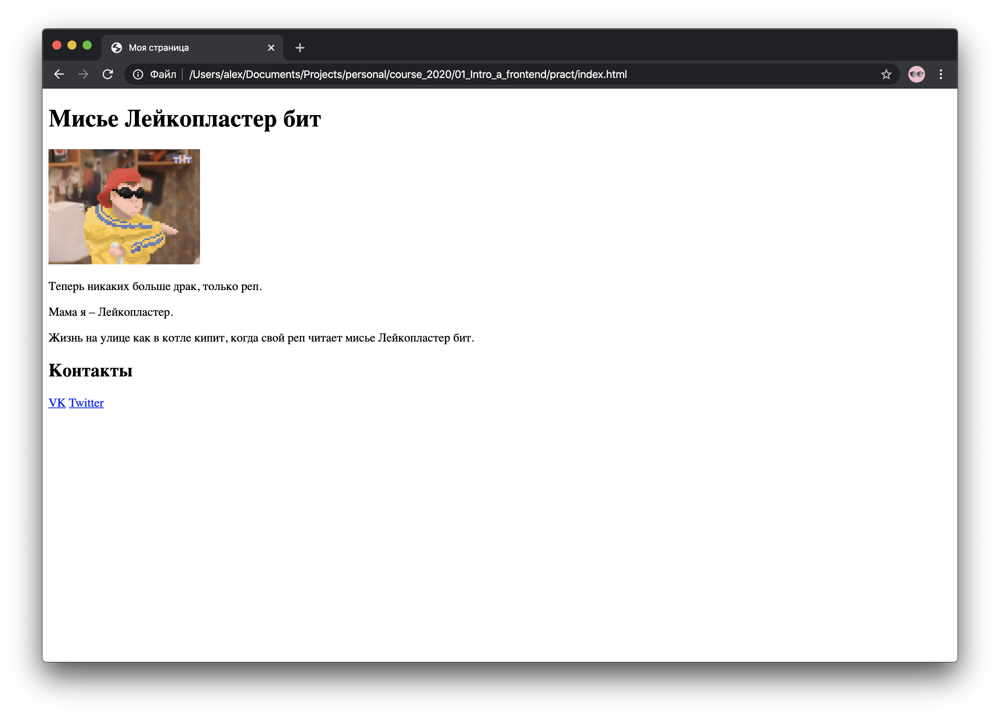
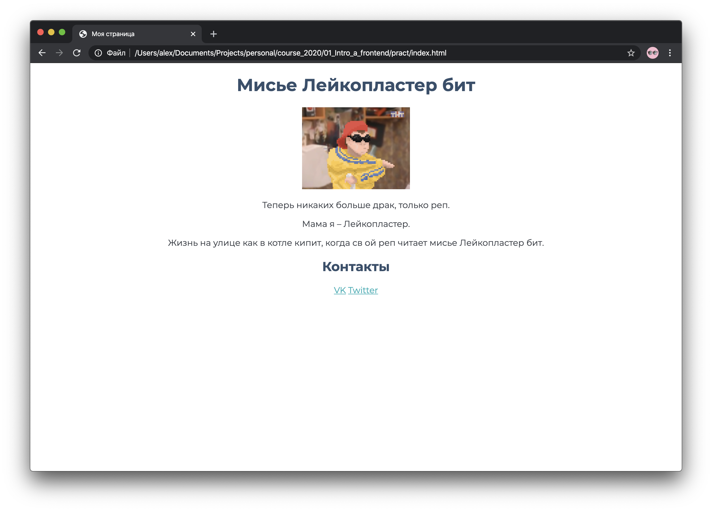

# Практика

В качестве практического задания давайте сделаем личную страницу как в социальных сетях.

Создайте HTML документ с именем `index.html`. И вставьте в него следующее содержимое:

```html
<!DOCTYPE html>
<html lang="ru">
<head>
  <meta charset="UTF-8">
  <meta name="viewport" content="width=device-width, initial-scale=1.0">
  <meta http-equiv="X-UA-Compatible" content="ie=edge">
  <title>Моя страница</title>
</head>
<body>
  Привет мир!
</body>
</html>
```

Откройте ее в браузере.

На странице присутсвует 1 надпись – "Привет мир!", напишем вместо нее свое имя и попробуем сделать из него заголовок.

Всего в HTML присутсвует 6 типов заголовков разного размера: `h1`, `h2`, `h3`, `h4`. `h5`, `h6`.

Заголовок первого уровня `h1` – самый крупный, а `h6` – меньше простого текста.

Они помогают поисковикам и "читалкам" понимать содержимое вашей страницы.

Какая же страница в социальной сети без аватарки?
Чтобы добавить изображение в HTML документ, существует тег ``. Обратите внимание что этот тег создаётся всего одним открывающим тегом. У `` нет закрывающего тега, т.к нет смысла сообщать браузеру где закончится картинка.

Итак добавим тег `` и в значения аттрибута `src`, напишем URL картинки, которую хотим добавить. Чтобы изображение не было слижком большим сделаем его фиксированного размера для этого помимо аттрибута `src` добавим следующие аттрибут `width` со значением `100`.

Теперь на странице присутвсует имя и аватарка, давайте добавим текст на страницу. Для этого создадим тег `<p>` и напишем в нем что-то о себе.

Вся изюминка HTML докуметов в том что по ним можно переходить, добавим ссылку на какой-либо ресурс. Для этого создадим раздел с контактами в социальных сетях.

Добавим под параграфом заголовок второго уровня `h2`, напишем внутри него `контакты`, это должно выглядеть следующим образом:

```html
<h2>Контакты</h2>
```

Теперь перейдем к ссылкам на наши контакты. Создадим тег `<a>`, внутри напишем название той соц сети, на которую будет вести ссылка и добавим аттрибут `href` со значением URL соц сети.

Прим.

```html
<a href="https://twitter.com/elonmusk">Twitter</a>
```

На данном этапе ваша страница должна выглядеть примерно так:

<p align="center">
  
</p>

В полне ничего ... для 90х годов. В наше время этого мало, нужны цвета, шрифты, отступы.

За то как выглядит страница и ее элементы, отвечает CSS.

Чтобы добавить элементу индивидуальный стиль, в тег встраивается аттрибут `style`. Ему присваиваются свойства и их значения.

Стиль, заданный внутри тега, называется встроенным или инлайновым.

Для начала добавим другой шрифт, для этого в тег `head`, добавьте следующее: `<link href="https://fonts.googleapis.com/css?family=Montserrat:400,500,700&display=swap" rel="stylesheet">`

Только что мы подключили к странице кастомный шрифт, давайте применим его.

Добавим в тег `body` аттрибут `style` со следующим значением: `font-family: 'Montserrat', sans-serif;`.

Обновите страницу и вы заметите что все текста на странице поменяли шрифт.

Чтобы выравнить содержимое страницы по центру, добавьте в этот же аатрибут `style` следующее `text-align: center;`.

Красота...

Но черный цвет для текста слижком скучно, поменяйте цвет для `h1` и `h2` на `#364f6b`. Чтобы это осуществить в атрибут `style` присвойте значение `color: #364f6b`.

Таким же образом поменяйте цвет для параграфов на `#393e46` и цвет ссылок на `#00adb5`.

После этих манипуляций страница должна выглядеть следующим образом:

<p align="center">
  
</p>

Уже лучше, но на награду за самый красивый сайт от [FWA](https://thefwa.com/awards/page/1/) не тянет.

Как вы могли заметить, описывать стили в тегах – не самое приятное задание. А теперь представьте что на странице свыше 1000 тегов.

На такой случай в CSS можно задавать праввила в отдельном теге `<style>` и в отдельных `.css` файлах. Но об этом на следующих занятиях.
