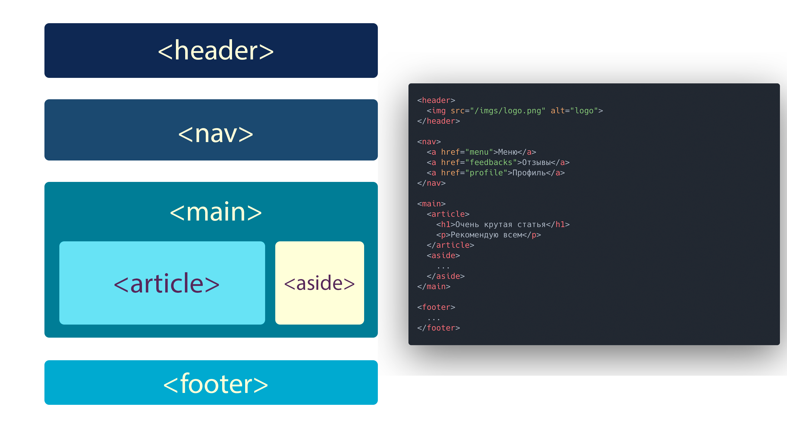

# Основы HTML

## Структура HTML5-документа

Как мы выяснили с той лекции, HTML страница состоит из 2х частей – раздел `<head>` и `<body>`.

Практически любая современная HTML страница остоит из нескольких блоков:

- Header - шапка сайта
- Блок контента состоящий из секций
- Footer или подвал

Каждый блок состоит из HTML5 тегов разметки. 

Они необходимы для того чтобы поисковые системы, читалки и т.п могли понять что находится на странице.

<p align="center">
  
</p>

## Теги для работы с текстом

Основная часть любой страницы - текст. Для его форматирования существует множество различных тегов. 

Расмотри основные из них.

### Заголовки

Для создания структуру текста используются заголовки.

В HTML предусмотрено 6 уровней заголовков.

На практике редко приходится пользоваться заголовками ниже 3го уровня.

Создаются они следующим образом:

```html
<h1>Очень важный заголовок первого уровня</h1>
<h2>Не менее важный заголовок второго уровня</h2>
<h3>Ну такой обычный заголовок третьего уровня</h3>
<h4>Кто же этот парень? А это заголовок четвертого уровня</h4>
<h5>Этого парня явно не приглашают на вечеринки</h5>
<h6>Только посмотрите на этого кроху, он же меньше обычного текста</h6>
```

Ну и как в действительности отображаются заголовки, можно посмотреть чуть ниже

<details>
  <summary>Щекл, чтобы глянуть</summary>

  <h1>Очень важный заголовок первого уровня</h1>
  <h2>Не менее важный заголовок второго уровня</h2>
  <h3>Ну такой обычный заголовок третьего уровня</h3>
  <h4>Кто же этот парень? А это заголовок четвертого уровня</h4>
  <h5>Этого парня явно не приглашают на вечеринки</h5>
  <h6>Только посмотрите на этого кроху, он же меньше обычного текста</h6>

</details>

### p

`<p>` - Параграф или абзац, был разобран в предыдущей лекции. Текст заключенный в него начинается с новой строки, а так же абзацы идущие друг за другом разделяются между собой отбивкой.

<details>
  <summary>Использование</summary>

  Пример как выделить текст в абзац:

  ```html
  <p>Простой, но лаконичный текст</p>
  ```

  И как он будет выглядеть:

  <p>Простой, но лаконичный текст</p>

</details>


### b

`<b>` - Устанавливает жирное начертание шрифта. Допускается его использование с другими тегами.

<details>
  <summary>Использование</summary>

  Пример:
  ```html
  <p>Простой, но лаконичный текст постепенно <b>жирнеет</b></p>
  ```

  Результат:
  <p>Простой, но лаконичный текст постепенно <b>жирнеет</b></p>

</details>

### i

`<i>` - Устанавливает курсивное начертание шрифта.

<details>
  <summary>Использование</summary>

  Пример:
  ```html
  <p>Простой, но лаконичный текст с <i>курсивом</i></p>
  ```

  Результат:
  <p>Простой, но лаконичный текст с <i>курсивом</i></p>

</details>

### s

`<s>` - Позволяет зачеркнуть текст.

<details>
  <summary>Использование</summary>
  
  Пример:
  ```html
  <p>Простой, но лаконичный текст <s>с никому не нужной информацией</s></p>
  ```

  Результат:
  <p>Простой, но лаконичный текст <s>с никому не нужной информацией</s></p>

</details>

### strong

`<strong>` - Так же как и `<b>` выделяет текст жирным, но в отличии от него `<strong>` дает понять читалкам, что в него выделен логичиски важный текст.

<details>
  <summary>Использование</summary>
    
  Пример:
  ```html
  <p>Простой, но лаконичный текст постепенно <b>жирнеет, но не теряет важности</b></p>
  ```

  Результат:
  <p>Простой, но лаконичный текст постепенно <b>жирнеет, но не теряет важности!</b></p>

</details>

### u 

`<u>` - Добавляет тексту подчеркивание.

<details>
  <summary>Использование</summary>
  
  Пример:
  ```html
  <p>Простой, но лаконичный текст с <u>подчеркиванием</u></p>
  ```

  Результат:
  <p>Простой, но лаконичный текст с <u>подчеркиванием</u></p>

</details>

## Списки

Eще один важный элемент встречающийся во многих документах – списки.

Они бывают 2х видов: Неупорядоченные и упорядоченные.

### Неупорядоченные списки

Для неупорядоченные списков в HTML существует тег `<ul>`, внутри которого каждый элемент списка необходимо помечать тегом `<li>`.

Пример:

```html
<ul>
  <li>Пункт 1</li>
  <li>Пункт 2</li>
  <li>Пункт 3</li>
<ul>
```

### Упорядоченные списки

Пример:

```html
<ol>
  <li>Первый пункт</li>
  <li>Второй пункт</li>
<ol>
```

### Изображения

Для отображения изображений в HTML существует тег ``.

У тега `` есть 2 основных аттрибута: `src` и `alt`.

`src` – указывает на расположение изображения.

`alt` – Задает альтернативный текст, который будет отображаться, если изображение не сможет загрузиться.

Пример:

```html

```
