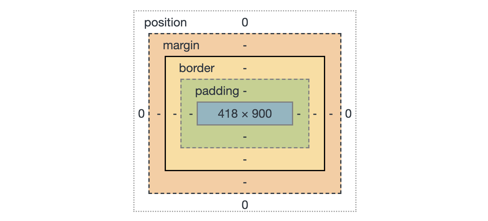

# Основы CSS

На этом уроке изучим основные CSS свойства.

## Создание стилей

Как говорилось ранее на предыдущих уроках, css можно создавать несколькими способами.

### Inline-стили

```html
<body>
  <div style="color: red">Пацаны и пацанессы, <a href="http://instagram.com/yo.manicure">записываемся на ноготочки</a></div>

  ...
</body>
```

### С помощью тега `<style>`

```html
<head>
  <style>
    div {
      color: red;
    }
  </style>
</head>
<body>
  <div>Пацаны и пацанессы, <a href="http://instagram.com/yo.manicure">записываемся на ноготочки</a></div>
  
  ...
</body>
```

### Импорт с помощью тега `<link>`

Создать файл `styles.css`.

```css
  /* styles.css */
  div {
    color: red;
  }
```

```html
<head>
  <!-- Импортируем стили -->
  <link rel="stylesheet" type="text/css" href="styles.css">
</head>
<body>
  <div>Пацаны и пацанессы, <a href="http://instagram.com/yo.manicure">записываемся на ноготочки</a></div>
  
  ...
</body>
```

### Импорт с помощью правила `@import`

```html
<head>
  <style>
    /* Импортируем стили */
    @import url("styles.css");
  </style>
</head>
<body>
  <div>Пацаны и пацанессы, <a href="http://instagram.com/yo.manicure">записываемся на ноготочки</a></div>
  
  ...
</body>
```

В текущем примере задается красный цвет текста для все `<div>` тегов. Но чаще всего необходимо менять стили только у конкретных элементов на странице. Это возможно реализовать с помощью селекторов `id` и `class`.

## Селектор `id`

Селектор `id` предназначен для применения стилей уникальных элементов на HTML странице. Такими элементами могут быть: Шапка страницы, блок меню, меню навигации, подвал сайта и т.п.

Для использования селектора id, нужно создать идентификатор (id), придумав ему уникальное имя, и прописать его в атрибуте id элемента, к которому будет применяться стиль. В CSS коде селектор id начинается с символа `#` сразу после которого идет имя идентификатора.

Каждый идентификатор может встречаться на странице только один раз, т.е. определенный id должен быть использован на странице только с тем тегом, для которого он предназначен. Если один и тот же идентификатор будет применен более, чем к одному элементу, во-первых HTML код не пройдет валидацию, во-вторых это может вызвать некорректную обработку кода браузером и вы можете увидеть не тот результат, которого ожидали.

Пример работы селектора id:

```html
<!DOCTYPE html>
<html lang="ru">

<head>
  <title>Очередной сайт с кучей рекламы</title>
  <style>
    /* Задаем стили для блока с id="ad-block" */
    #ad-block {
      color: red;
    }
  </style>
</head>

<body>
  <!-- Задаем блоку аттрибут id со значением "ad-block" -->
  <div id="ad-block">Пацаны и пацанессы, <a href="http://instagram.com/yo.manicure">записываемся на ноготочки</a></div>
  
  ...
</body>

</html>
```

## Селектор `class`

Селектор `class` позволяет задать стиль к нескольким элементам на HTML странице.

Пример работы селектора class:

```html
<!DOCTYPE html>
<html lang="ru">

<head>
  <title>Очередной сайт с кучей рекламы</title>
  <style>
    /* Задаем стили для блока с class="ad-block" */
    .ad-block {
      color: red;
    }
  </style>
</head>

<body>
  <!-- Задаем блоку аттрибут class со значением "ad-block" -->
  <div class="ad-block">Пацаны и пацанессы, <a href="http://instagram.com/yo.manicure">записываемся на ноготочки</a></div>
  
  ...
</body>

</html>
```

## Отсутпы

Существует 2 типа отступов – внешине отступы (`margin`) и внутренние (`padding`).

<p align="center">
  
</p>

## Размеры

- px (Пиксели)
- em (Высота 1 символа)
- ex (Размер относительно символа `x`)
- pt (типографский пункт = `4/3 px`)

`width`, `min-width` и `max-width`

'Хак' для выравнивания по центру:

```css
margin: 0 auto;
```

## Блочные и сточные элементы

`inline` - Сточные элементы
`block` - Блочные элементы (Занимают всю ширину, до и после поязвляются переносы строк)

```css
display: block | inline | inline-block | none;

/* Также для скрытия элементы есть: */

visibility: hidden;
```

`inline-block` – Убирает особенность блочных элементов – переносы

## Обтекание, позиционирование и слои

```css
float: right | left | none;
```

`float` – Выравнивает элементы по правому или левому краю, застовляет элементы их обтекать.

Отключение float'ов

```css
clear: left;
```

Скрытие части которая не попадает во viewport:

```css
overflow: hidden;
overflow-x: hidden;
overflow-y: hidden;

/* По default auto */
overflow: auto | scroll | hidden;
```

```css
position: relative | absolute | fixed:
```

```css
position: relative:

right: 10px
left: 10px
...
```

```css
position: absolute:

right: 10px
left: 10px
...
```
